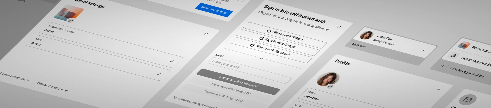

# Sandem

[](LICENSE)
[](https://svelte.dev)
[](https://convex.dev)

---

<picture>
  <source srcset="./bannerDark.webp" media="(prefers-color-scheme: dark)">
  <source srcset="./banner.webp" media="(prefers-color-scheme: light)">
  
</picture>

**Version:** 0.8.0 · **Status:** ✅ build passing · all checks green

---

A collaborative, in-browser IDE powered by [WebContainer API](https://webcontainer.io). Spin up a real Node.js environment in your browser tab, edit files in Monaco, run commands in a full terminal, see a live preview — all without a cloud VM.

---

## What it does

| Feature                          | Tech                              |
| -------------------------------- | --------------------------------- |
| In-browser Node.js runtime       | WebContainer API (StackBlitz)     |
| Code editor with multi-file tabs | Monaco Editor + Yjs               |
| Real-time collaboration          | Liveblocks + Yjs CRDT             |
| Live preview iframe              | WebContainer `server-ready` event |
| Integrated terminal              | xterm.js → `jsh` shell            |
| Project persistence              | Convex real-time database         |
| Auth (email + GitHub OAuth)      | better-auth + Convex adapter      |
| Themeable UI                     | CSS semantic tokens, 4 palettes   |

---

## How it does

- **Frontend:** [SvelteKit](https://svelte.dev/docs) ([`Svelte v5`](https://github.com/sveltejs/svelte) with runes)
- **UI toolkit:** a growing library of reusable, themeable components (`Button`, `Card`, `Accordion`, `Tabs`, etc.) built with modern Svelte conventions and semantic CSS tokens.
- **Theming:** four built‑in palettes (`default`, `forest`, `solar`, `ocean`) plus light/dark mode toggling via `ModeToggle`/`ThemeSwitcher`. Colors are managed with semantic custom properties and layered tokens.
- **IDE Engine:** [Monaco Editor](https://microsoft.github.io/monaco-editor/) + [WebContainer API](https://webcontainer.io) powering an in‑browser Node.js environment.
- **Auth:** [`better-auth`](https://github.com/better-auth/better-auth)) + [`@mmailaender/convex-better-auth-svelte`](https://github.com/mmailaender/convex-better-auth-svelte) with Convex-backed sessions.
- **Terminal:** [`xterm.js`](https://github.com/xtermjs/xterm.js) (via [`@battlefieldduck/xterm-svelte`](https://github.com/battlefieldduck/xterm-svelte)) hooked into the WebContainer shell.
- **Collaboration:** [`Liveblocks`](https://liveblocks.io/) + [`Yjs`](https://github.com/yjs/yjs) sync for realtime co‑editing.
- **Backend:** [`Convex`](https://github.com/get-convex/convex-backend) serverless functions (folder: `src/convex`).
- **Docker:** development and deployment ready with `Dockerfile` / `docker-compose` (`README.Docker.md`).
- **Tests:** [`Vitest`](https://github.com/vitest-dev/vitest) (unit) and [`Playwright`](https://github.com/microsoft/playwright) (E2E).

---

## Quick start

```bash
pnpm install
cp .env.example .env.local   # add your Convex + Liveblocks keys
pnpm dev
```

App runs at `http://localhost:5173`. The Convex dev server starts alongside it via `concurrently`.

> **Note:** WebContainer requires `Cross-Origin-Embedder-Policy: require-corp` and `Cross-Origin-Opener-Policy: same-origin` headers. These are set automatically by `src/hooks.server.ts` for all non-API routes.

---

## Environment variables

```env
# .env.local
PUBLIC_CONVEX_URL=https://your-deployment.convex.cloud
CONVEX_DEPLOYMENT=dev:your-deployment-name

LIVEBLOCKS_SECRET_KEY=sk_dev_...
SITE_URL=http://localhost:5173

GITHUB_CLIENT_ID=...
GITHUB_CLIENT_SECRET=...
```

---

## Project layout

```
src/
├── convex/               # Backend: schema, mutations, queries, auth
│   ├── schema.ts         # projects table definition
│   ├── projects.ts       # CRUD mutations/queries
│   ├── auth.ts           # better-auth integration
│   └── http.ts           # auth HTTP routes
├── lib/
│   ├── components/
│   │   └── ide/          # Editor, Terminal, Preview, Tabs
│   ├── hooks/            # useAutoSave, useFilesystem, usePreview, useShellProcess
│   └── utils/            # ide-context, auth-client, filesystem-utils, templates
└── routes/
    ├── (home)/           # Landing page
    ├── login/            # Auth page (sign in / sign up)
    ├── projects/         # Dashboard — list and create projects
    └── projects/[projectId]/   # IDE layout + page
```

---

## Architecture

### Boot sequence (`/projects/[projectId]`)

1. SvelteKit `+layout.ts` disables SSR, extracts `projectId` from params
2. `+layout.svelte` fires `WebContainer.boot()` immediately (doesn't wait for data)
3. Convex `useQuery` fetches project data live
4. `$effect` awaits both, then calls `webcontainer.mount(projectFilesToFSTree(project.files))`
5. `setIDEContext()` exposes stable closures to child components
6. `{#if ready}` gate renders Editor, Terminal, Preview only after mount completes

### File sync

- **Convex → WebContainer:** on mount, all `project.files` are written to the FS via `webcontainer.mount()`
- **Editor → WebContainer:** every keystroke writes to the FS immediately via `wc.fs.writeFile()`
- **Editor → Convex:** debounced 1.5s autosave via `useConvexClient().mutation(updateProject)`
- **Collaboration:** Liveblocks Yjs provider syncs editor content across peers; local changes (origin `null`) trigger saves, remote changes are skipped

### Template format

Files are stored in Convex as `{ name: string, contents: string }[]` — a flat array. `filesystem-utils.ts` converts this to a WebContainer `FileSystemTree` at mount time, handling nested paths.

```ts
// Creating a project from a template
await client.mutation(api.projects.createProject, {
	title: 'My App',
	ownerId: user._id,
	files: VITE_REACT_TEMPLATE.files, // ProjectFile[] — flat array
	entry: VITE_REACT_TEMPLATE.entry,
	visibleFiles: VITE_REACT_TEMPLATE.visibleFiles
});
```

---

## UI / Theming

Four built-in palettes (`default`, `forest`, `solar`, `ocean`) with light/dark variants, controlled via `data-theme` and `data-mode` attributes on `<html>`. All component colors reference semantic CSS variables (`--bg`, `--mg`, `--fg`, `--text`, `--muted`, `--border`, `--accent`, etc.) defined in `app.css`.

The IDE route (`/projects/[projectId]`) overrides the theme with hardcoded dark values via `body:has(.ide-grid)` — editors always render dark regardless of the active theme.

---

## Scripts

```bash
pnpm dev          # start client + Convex dev server
pnpm build        # production build
pnpm check        # svelte-check TypeScript diagnostics
pnpm lint         # ESLint
pnpm format       # Prettier
pnpm test         # Vitest unit tests
pnpm e2e          # Playwright E2E
```

---

## Docker

```bash
docker compose up --build
```

See [README.Docker.md](README.Docker.md) for environment variable injection and production deployment notes.

---

## Deployment notes

- Ensure COOP/COEP headers survive your hosting proxy/CDN — WebContainer will not boot without them
- Convex deployment URL must be set in environment; `PUBLIC_CONVEX_URL=null` breaks all queries
- Liveblocks secret key is server-only; never expose it client-side

---

## License

[MIT](LICENSE)
